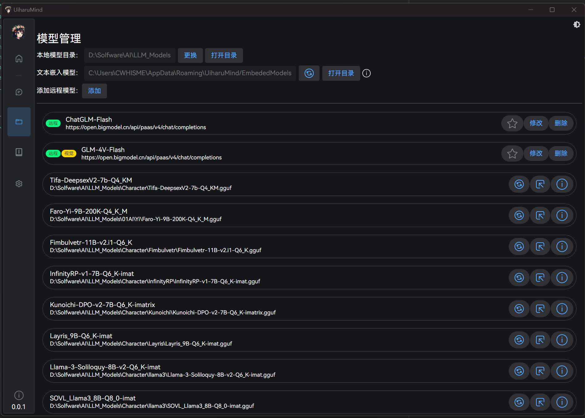

# UiharuMind

UiharuMind 目前支持的功能有：

1. 本地化部署 AI 模型：UiharuMind 可以运行 GGUF 格式的的本地 AI 语言模型(后端通过调用 llama.cpp 实现)
2. 远程模型调用：UiharuMind 也支持远程模型调用，可以通过 UiharuMind 的界面调用远程的 AI 模型，并获取模型的输出。
3. 常规聊天：支持工具人、角色扮演两种类型的聊天模式，可以和 AI 模型进行交流。
4. 快捷功能：通过一些快捷键调出快速操作，例如复制文字、图片后快速操作。
5. 截图：多模态 AI OCR、截图聊天
6. 知识库聊天(支持文件、文本、文件夹、网址)

> 注：
> 因为本地部署的 AI 模型后端是使用 llama-server 开启了一个兼容 OpenAI 格式的本地服务器，因此其实也可以作为其它应用需要的远程 AI 的后端(本地部署)。
> 默认端口为 1396，连接时直接填入 IP:1369 即可。
> 例如：http://127.0.0.1:1369

更多可以参考：[UiharuMind 工具使用指南](https://wangjiaying.top/2025/02/16/UiharuMind%E4%BD%BF%E7%94%A8%E6%8C%87%E5%8D%97/)